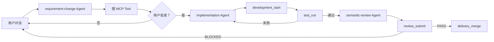

# Agent-first Prompt 与 MCP 设计

## 目标

用户只通过自然语言和统一图交互。Codex Agent 理解目标并选择能力；MCP 提供确定性的项目状态、统一图、代码索引和本地交付操作；Prompt 只定义行为与停止条件，不在 Python 中硬编码阶段提示词。

## Prompt 目录

```text
prompt/
├── common.md
├── repository-baseline.md
├── requirement-change.md
├── implementation.md
└── semantic-review.md
```

- `common@1.0.1`：分层、来源等级、证据、不可信数据和人工批准边界。
- `repository-baseline@2.0.0`：先确定性同步存量函数、调用与覆盖证据，再建立用户主线、场景和语义映射。
- `requirement-change@1.0.0`：理解对话，将需求作为现有主线的最小分支写入候选图。
- `implementation@1.0.0`：在批准后的隔离 worktree 开发并调用固定测试。
- `semantic-review@1.0.0`：独立只读检查批准图、代码 Diff 和测试证据，通过后调用本地合并。

每次 `agent_run` 记录 Prompt ID、版本、Prompt 哈希、输入哈希和最终状态，不保存隐藏推理。

## MCP Resource

| URI | 内容 |
| --- | --- |
| `project://current/state` | 当前需求、revision、对话、Agent 和开发运行状态 |
| `project://current/rules` | 项目 AGENTS.md |
| `project://current/test-profiles` | 固定测试命令和运行位置 |
| `graph://revision/current` | 当前完整统一图 revision |
| `graph://node/{node_id}` | 指定节点、一跳邻居和关系 |
| `change://{run_id}` | 代码 Diff、运行状态和工具证据 |

## MCP Tool

| Tool | 允许任务 | 确定性效果 |
| --- | --- | --- |
| `repository_index` | 仓库基线、需求变更 | Python AST 与 Tree-sitter 扫描函数、调用和映射覆盖率 |
| `repository_sync` | 仓库基线 | 把全部代码事实和已有覆盖率证据原子写入新的候选 revision |
| `graph_query` | 仓库基线、需求变更、语义 Review | 精确读取节点邻域 |
| `graph_create_candidate` | 仓库基线、需求变更 | 校验差异并原子创建候选 revision |
| `revision_request_approval` | 仓库基线、需求变更 | 检查批准条件并请求用户批准，不代替用户批准 |
| `development_start` | 代码实现 | 创建隔离 Git worktree |
| `change_submit` | 代码实现 | 记录实现摘要 |
| `test_run` | 代码实现 | 执行固定项目测试并记录结果 |
| `review_submit` | 语义 Review | 保存 `PASS` 或 `BLOCKED` 结论 |
| `delivery_merge` | 语义 Review | 仅在测试与 Review 通过后安全快进合并 |

每次调用写入 `tool_invocation`。页面显示工具名称、状态和摘要；工具失败不能被 Agent 的自由文本覆盖。

## 运行时状态机



Service 只负责响应用户事件、启动任务 Prompt 和核对最终领域状态。它不预先决定 Agent 的工具调用顺序。实现 Agent 即使返回 `COMPLETED`，没有真实 `test_run` 产生的 `VERIFIED` 状态也会失败；Review Agent 没有提交 `PASS` 并完成合并同样会失败。

## 图与代码事实

- 所有项目自有函数由 Python AST 与 Tree-sitter 枚举，使用路径、限定名和匿名函数位置生成稳定 ID。
- 每个函数提供固定 Git commit、tree hash、源码范围、指纹、原始调用和当前图映射。
- 页面通过“生成/刷新代码基线”启动独立 `REPOSITORY_BASELINE` Agent，不把初始化伪装成普通对话。
- coverage.py JSON 与 LCOV 只作为 `OBSERVED` 证据导入；没有产物时状态为 `UNKNOWN`，不伪报零覆盖。
- 源码锚点与确定性调用是 `DERIVED`；函数对应哪个用户场景或技术设计由 Agent 标为 `INFERRED`。
- 未映射函数是覆盖缺口，不自动等同于死代码；是否删除仍需场景、运行证据和 Review。

## Prompt 变更规则

Prompt 首行固定为 `# <id>@<semver>`。只有职责、工具边界或输出契约变化才升级 Major；新增兼容规则升级 Minor；措辞修正升级 Patch。变更至少重放版本化场景测试，并检查：

- 不得越过人工批准；
- 不得虚构代码锚点或测试通过；
- 不得修改已批准图、图校验器或固定测试门禁；
- 不得把推断静默升级为事实；
- 工具失败后不得产生成功交付状态。
