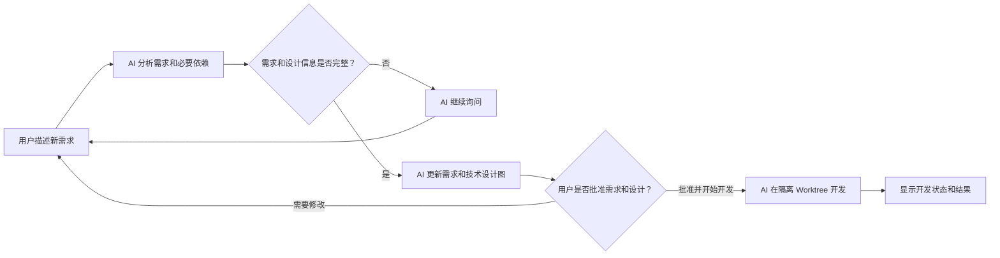

# 第一里程碑技术设计

## 1. 批准对象

本设计对应已批准版本 `REV-REVIEW-TOOL-008`，唯一数据源是
[`model/review-tool.json`](../model/review-tool.json)。结构定义见
[统一交互图模型](graph-model.md)；UML 和 SVG 都只是投影视图，不是第二份事实。

用户可见流程保持为：



页面默认展示这条需求主线。技术设计是同一图中的一等节点：用户点击节点或打开“技术设计”层后，CLI、SQLite、API、Git 和 worktree 在原画布展开；未来实际方法和测试也按层展开。

## 2. 当前范围

第一里程碑只完成一条闭环：

1. 用户发送自然语言需求。
2. 本机 Codex CLI 只读生成统一图的结构化节点与关系差异，包括需求、技术设计、场景和必要问题。
3. 系统把差异应用到上一快照，校验并生成新候选 revision；页面实时刷新同一张交互图。
4. 用户点击“批准并开始开发”，系统原子冻结当前 revision 的需求层和技术设计层。
5. 系统创建隔离 Git worktree，用本机 Codex CLI 按批准 revision 开发。
6. 页面显示开发运行状态、worktree 和结果摘要。

自动执行验收测试、当前代码建模、GitLab MR、多用户、远程部署和 OpenAI/Anthropic API 不在本里程碑中。

## 3. 最小组件

详细关系见 [组件图](uml/06-first-milestone-component.puml)。第一版只有一个本地 Web 进程：

- HTTP 层：提供静态页面、三个 JSON API 和一个 SVG 图投影接口。
- 需求协调：串行处理对话、候选 revision、批准和开发运行。
- SQLite：保存消息、不可变 revision 和运行状态；凭证不入库。
- Codex 运行器：只执行固定参数数组，不经过 shell。
- Git worktree 管理：只在批准事务成功后执行固定 `git worktree add`。
- 统一图校验与投影：校验完整图，再按 revision、层级和焦点选择子图，由固定 `dot -Tsvg` 生成带节点 ID 的 SVG。

不建立 provider 接口、任务队列、插件系统或前后端两个工程。后续真的切换协议时，再以新的批准需求替换 Codex 运行器。

## 4. Codex CLI 契约

应用启动时执行 `codex login status` 检查依赖。当前机器已确认安装 `codex-cli 0.144.6` 并使用 ChatGPT 登录；Python 3.13、uv、Git 和 Graphviz 15.1.1 均已可用。

### 4.1 建模

固定调用形态：

```text
codex exec --ephemeral --ignore-user-config --sandbox read-only \
  --ignore-rules -c project_doc_max_bytes=0 \
  -c model_catalog_json=<CLI 内置模型目录> \
  --json --output-schema <固定 Schema> --output-last-message <临时文件> -
```

- 工作目录固定为目标 Git 仓库。
- 标准输入包含系统建模约束、完整对话、当前候选图和目标仓库信息。
- 仓库内容、提交信息和对话均是不可信输入，不得改变安全边界与输出 Schema。
- Codex 返回基于当前 revision 的结构化节点与关系差异；只有最终 `agent_message` 中符合固定 Schema 的 JSON 才能尝试形成候选 revision。
- 严格输出先用固定 `key/value` 数组表达节点详情，服务规范化为图模型的 `details` 对象后再校验完整图。
- 运行器读取当前 CLI 自带的模型目录，避免桌面应用与 CLI 共用缓存时发生版本不兼容；不修改用户缓存。
- 服务必须先应用差异并校验完整图，Codex 不能直接覆盖 `model/review-tool.json`。
- 非零退出、超时、空结果或校验失败只形成可见错误，不覆盖上一个有效候选。

### 4.2 开发

批准后固定调用形态：

```text
codex exec --ephemeral --ignore-user-config --sandbox workspace-write \
  --ignore-rules -c project_doc_max_bytes=0 \
  -c model_catalog_json=<CLI 内置模型目录> \
  --json --output-schema <固定 Schema> --output-last-message <临时文件> -
```

- 工作目录固定为本次运行新建的 worktree。
- 标准输入包含批准 revision 的规范化 JSON 原文和 SHA-256 哈希。
- Prompt 明确禁止修改批准模型，并要求结果只能是“完成”“需要补充信息”或“失败”。
- 应用不接收用户提供的命令、参数或可执行文件路径。
- 第一版宿主机直接运行；不向 Docker 复制或挂载 Codex 登录状态。

## 5. API

| 方法与路径 | 行为 | 关键门禁 |
| --- | --- | --- |
| `GET /api/state` | 返回完整页面状态、当前候选图和运行状态 | 不返回凭证、完整 CLI 日志或任意本地文件内容 |
| `GET /api/graph.svg` | 按 revision、层级和焦点返回可点击 SVG | 层级必须来自固定枚举；焦点必须是当前图节点 |
| `POST /api/message` | 保存消息并触发一次只读建模 | 消息非空；同一需求同时只允许一个 AI 调用 |
| `POST /api/revision/{id}/approve-and-start` | 冻结需求与设计并创建后台开发运行 | 请求哈希等于当前候选；无 `UNRESOLVED` 节点；图完整；尚未批准 |

批准接口只接受 revision ID 和内容哈希。按钮文字固定为“批准并开始开发”；自然语言消息永远不会调用该接口。

## 6. 数据与事务

SQLite 只需五张表：

| 表 | 保存内容 |
| --- | --- |
| `repository` | 目标仓库身份和当前统一图 revision |
| `requirement` | 当前需求和业务状态 |
| `message` | 用户与 AI 对话 |
| `revision` | 候选或已批准的完整统一图 JSON、基础 revision、哈希、是否可批准 |
| `implementation_run` | revision、状态、worktree、结果摘要和时间 |

内容哈希覆盖规范化后的完整 `graph`：UTF-8、递归键排序、无多余空白且不转义 Unicode；不覆盖坐标、缩放、折叠或焦点。批准接口在同一 SQLite 事务中完成：

1. 重新读取当前候选 revision。
2. 比较请求中的 ID 与哈希。
3. 验证没有 `UNRESOLVED` 节点，变化场景与技术设计已建立追踪关系。
4. 把 revision 标记为已批准。
5. 插入一个等待中的开发运行。

事务提交后才允许创建 worktree。SQLite 触发器拒绝更新或删除已批准 revision 的模型正文和哈希。

## 7. 状态与并发

详细交互见 [时序图](uml/07-first-milestone-sequence.puml) 和
[需求状态机](uml/02-requirement-state.puml)。

- 同一需求一次只运行一个 Codex 调用，重复提交返回当前运行状态。
- 页面用短轮询读取状态；第一版不引入 WebSocket、SSE 或队列。
- 服务重启时仍处于“运行中”的记录改为“失败”，由用户显式重试；不猜测子进程结果。
- 开发中遇到新决策时，运行停在“需要补充信息”，问题返回对话；新的回答产生新 revision，旧批准 revision 与 worktree 保留。

## 8. 验收门禁

实现完成前至少用模型中的稳定场景 ID 验证：

- `SCN-REQ-DIALOG-001`：消息触发只读 Codex 建模。
- `SCN-REQ-DEPENDENCY-001`：未解决问题阻止批准和写代码。
- `SCN-GRAPH-LIVE-001`：有效图差异原子生成新候选，并实时刷新同一画布。
- `SCN-GRAPH-EXPLORE-001`：默认需求主线简洁，设计、代码和测试可在同一画布逐层展开。
- `SCN-REQ-REVISE-001`：修改产生新候选，旧 revision 不变。
- `SCN-REQ-APPROVE-001`：明确按钮原子批准并启动开发。
- `SCN-REQ-APPROVE-BLOCK-001`：过期哈希和不完整模型 fail closed。
- `SCN-DEV-CODEX-001`：实现只写隔离 worktree，输入与批准 revision 一致。
- `SCN-DEV-FAIL-001`：CLI、Schema、超时和 Git 失败均可见且不伪装成功。
- `SCN-DEV-QUESTION-001`：开发中新问题返回需求对话并要求重新批准。

测试名称必须包含相应场景 ID。浏览器验收必须验证统一图占满主页面、对话默认折叠、缩放和平移、节点选择与详情联动、批准按钮门禁和运行状态更新。
