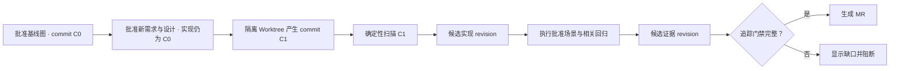

# 图与代码权威契约

## 1. 权威边界

`sdbp-review` 使用同一份版本化属性图连接需求、设计、代码和测试，但不同事实仍由各自来源负责：

| 事实 | 权威来源 |
| --- | --- |
| 用户可观察行为和目标设计 | 用户批准的需求层与技术设计层 |
| 指定时刻实际存在的实现 | 不可变 Git commit |
| 代码结构及调用、读写、外部调用关系 | 对固定 commit 执行的确定性扫描结果 |
| 测试实际执行和覆盖的行为 | 固定命令产生的测试运行证据 |
| 上述事实之间的追踪关系 | 版本化统一图 |

UML、SVG、页面布局和 AI 总结都只是统一图的投影或解释。AI 不能把解释升级为代码事实，扫描器也不能修改用户批准的需求与设计。

图与代码之间采用“**双向追踪、单向授权**”：批准图规定允许实现什么；Git commit 证明实际实现了什么；扫描器只能把代码事实写入新的候选 revision。

## 2. CodeSnapshot

统一图 Schema v2 在 `graph.codeSnapshots` 中保存代码快照。每次代码建模先生成 `CodeSnapshot`，固定扫描事实成立的边界，不把运行时 HEAD 当成模型内容：

```json
{
  "id": "SNAPSHOT-REPOSITORY-LOCAL-A1B2C3D4",
  "repositoryId": "REPOSITORY-LOCAL",
  "commitSha": "0123456789abcdef0123456789abcdef01234567",
  "treeHash": "89abcdef0123456789abcdef0123456789abcdef",
  "scanHash": "0000000000000000000000000000000000000000000000000000000000000000",
  "roots": ["app", "tests"],
  "extractors": [
    {"id": "PYTHON-AST", "version": "1.0.0"}
  ]
}
```

- `repositoryId` 是仓库稳定身份，不随本地目录变化。
- `commitSha` 和 `treeHash` 必须来自同一个已提交 Git 快照；第一版不扫描脏工作区。
- `roots` 是本次扫描范围，使用仓库内规范化相对路径。
- `extractors` 固定所有确定性提取器及版本。
- `scanHash` 覆盖扫描范围、提取器版本、规范化实现节点、技术关系和所有缺口；计算时排除 `scanHash` 自身及需求、设计和测试层，避免循环依赖。
- 扫描时间、当前分支和本地绝对路径不进入模型，避免同一代码产生不同图。

仓库当前 HEAD 与 `commitSha` 不同表示投影已过期，由运行时计算并显示，不修改旧 revision。

## 3. CodeAnchor

实现节点和技术关系通过 `CodeAnchor` 定位到快照中的源码。行号是证据位置，不参与稳定 ID：

```json
{
  "snapshotId": "SNAPSHOT-REPOSITORY-LOCAL-A1B2C3D4",
  "path": "app/service.py",
  "range": {
    "start": {"line": 61, "column": 5},
    "end": {"line": 79, "column": 44}
  },
  "extractorId": "PYTHON-AST",
  "fingerprint": "0000000000000000000000000000000000000000000000000000000000000000"
}
```

- `path` 必须是仓库内相对路径，不允许绝对路径、反斜杠或 `..`。
- `range` 使用行号从 1 开始、列号从 0 开始的左闭右开区间，结束位置必须晚于开始位置。
- `extractorId` 必须存在于对应快照的 `extractors`。
- `fingerprint` 用于辅助识别移动和 Diff，不作为 AI 静默合并重命名的依据。
- 一个节点或关系可以有多个锚点，例如同一表由多个声明共同确定，或同一调用关系存在多个调用点。

`Repository` 实现节点只引用 `snapshotId`，无需伪造源码位置。其他 `DERIVED` 实现节点必须有至少一个锚点。

## 4. 节点与关系规则

### 4.1 实现节点

实现层节点必须包含 `snapshotId`。由扫描器确认的节点使用 `DERIVED`，AI 只能添加 `INFERRED` 节点：

以下示例中的 `<CodeAnchor>` 表示上一节定义的完整对象，不是可以写入模型的字符串值。

```json
{
  "id": "IMPL-SYMBOL-REVIEW-SERVICE-APPROVE",
  "layer": "implementation",
  "kind": "Symbol",
  "title": "批准并开始开发",
  "summary": "校验候选 revision 后创建实现运行。",
  "source": "DERIVED",
  "snapshotId": "SNAPSHOT-REPOSITORY-LOCAL-A1B2C3D4",
  "anchors": ["<CodeAnchor>"],
  "details": {
    "qualifiedName": "ReviewService.approve_and_start"
  }
}
```

稳定 ID 不包含 commit、行号或内容哈希。无法确定重命名时必须展示为删除和新增。

### 4.2 技术关系

`calls`、`reads`、`writes`、`invokes`、`creates`、`renders`、`configured_by` 和 `exposes` 描述实际代码行为。扫描器生成的这些关系必须包含 `snapshotId` 和调用点或表达式锚点：

```json
{
  "id": "EDGE-CALL-APPROVE-STORE",
  "sourceId": "IMPL-SYMBOL-REVIEW-SERVICE-APPROVE",
  "targetId": "IMPL-SYMBOL-STORE-APPROVE",
  "kind": "calls",
  "source": "DERIVED",
  "snapshotId": "SNAPSHOT-REPOSITORY-LOCAL-A1B2C3D4",
  "anchors": ["<调用表达式 CodeAnchor>"]
}
```

`contains` 只表达同一快照内的结构归属，需要 `snapshotId`，但不强制伪造调用位置。跨层的 `implemented_by` 表达设计到代码的语义追踪，其目标实现节点已经提供源码证据，因此关系本身不要求源码锚点。

静态分析无法确认动态分派时不得生成 `DERIVED calls`。扫描器保存明确缺口；AI 可以提出 `INFERRED` 候选，但不能让候选通过事实完整性门禁。

## 5. 完整性门禁

统一图校验器至少执行以下规则：

1. `CodeSnapshot.id` 唯一，所有 `snapshotId` 必须引用现存快照。
2. 锚点引用的快照和提取器必须存在。
3. 锚点路径和源码范围必须规范、有效。
4. 只有实现层节点和涉及实现事实的技术关系可以声明代码快照与锚点。
5. 所有实现节点必须属于一个快照，且不能标记为用户 `DECLARED` 事实。
6. 除 `Repository` 外，所有 `DERIVED` 实现节点必须有源码锚点。
7. 扫描器生成的行为关系必须属于一个快照并有源码锚点。
8. 同一技术关系的两端不得静默跨越不同快照；跨仓调用以 `invokes` 和两个仓库各自的边界事实表达。
9. `realized_by`、`implemented_by`、`verified_by` 和 `evidenced_by` 的跨层方向固定，反向关系无效。
10. AI 产生的实现节点或关系只能标为 `INFERRED` 或 `UNRESOLVED`。
11. 扫描到的每个函数必须由 Module 包含；每个含函数的 Module 必须关联至少一个需求或技术设计，函数默认继承该语义归属，直接函数归属覆盖默认值。
12. 当前 MR 修改的范围内，只要存在无法扫描、无法锚定或无法追踪到批准场景的生产代码，就阻断自动 Review。
13. 未改动的历史缺口保留在图中并计入债务，但不阻断无关 MR。

规则 9 和规则 10 共同避免两种错误：不能因为历史仓库不完整而永远无法开发，也不能让本次新增的未知代码静默进入主干。

## 6. Revision 生命周期



- 批准需求与设计不会创建不存在的实现节点。
- 扫描器只追加或更新实现层和扫描缺口，不修改已批准需求与设计原文。
- 测试运行只追加验证层和 `OBSERVED` 关系，不把运行结果改写成静态事实。
- MR 同时展示需求与设计 Diff、代码 Diff、实现图 Diff 和测试证据 Diff。

## 7. 代码链路投影

代码链路不是第二套模型。页面从统一图按场景投影：

```text
Scenario
→ realized_by
→ Design
→ implemented_by
→ EntryPoint
→ calls / reads / writes / invokes
→ Symbol、DataEntity、ExternalSystem
→ verified_by
→ Test、TestRun、Evidence
```

默认只显示选中场景的主路径；用户展开分支、调用上下文和测试证据。点击节点定位声明锚点，点击关系定位调用点锚点。完整仓库图仍保留未被当前投影显示的节点和缺口。

## 8. 当前实现范围

当前界面已经按本节规则从统一图投影需求相关主流程、直接场景和函数级代码调用链；实现节点、调用关系、源码锚点与测试覆盖存在时展示真实事实，缺失时明确显示“尚无代码链”，不使用界面样例伪造事实。

页面可启动仓库基线任务：扫描器确定性写入全部项目函数与可唯一解析的调用关系，刷新时保留仍指向现存稳定函数或 Module ID 的语义映射；覆盖率导入器读取 coverage.py JSON 或 LCOV 并生成 `OBSERVED` 验证证据。Agent 为每个 Module 补充 `implemented_by`，函数继承模块归属并可用直接关系细化；未归属函数、动态调用缺口和未知覆盖率始终保持可见。
