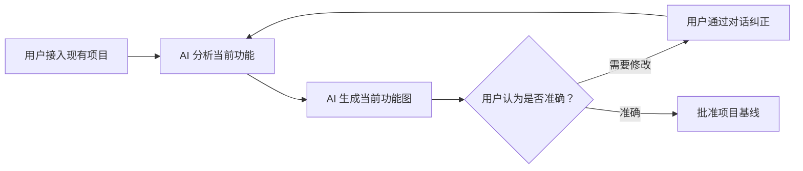
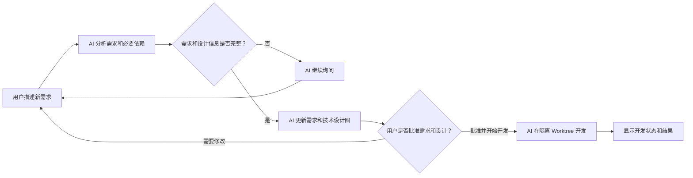

# 统一图的需求层定义

## 1. 定位

需求层用于让需求方确认系统是否完整、准确地理解了用户目标、场景、分支、规则和可观察结果。它属于
[统一交互图](graph-model.md)，不是一份独立 UML。

页面默认只投影需求主线。技术设计、代码实现和测试证据也是同一图的一等节点，通过层级开关或点击需求节点在原画布展开，而不是只放进隐藏属性。

## 2. 默认用户主线

现存项目首次建模时，默认投影为：



批准基线后的需求开发默认投影为：



默认投影只控制首次看到的节点，不限制统一图可以包含的技术节点。点击“AI 分析需求和必要依赖”可以在同一画布展开需求协调器、Codex 运行器和接口；点击“AI 在隔离 Worktree 开发”可以展开 Git、worktree 和写入边界。

## 3. 需求节点

需求层允许以下类型：

| 类型 | 含义 | 示例 |
| --- | --- | --- |
| `Actor` | 发起操作或接收结果的用户角色 | 需求方、开发者 |
| `Goal` | 用户希望达成的业务目标 | 让 AI 按批准图完成开发 |
| `Flow` | 一条完整的用户主线 | 从描述需求到开发结果 |
| `Scenario` | 在明确条件下可以独立验收的行为 | 批准没有未知问题的图 |
| `Action` | 用户或系统在场景中的行为 | 用户提交需求、AI 更新图 |
| `Decision` | 决定后续分支的业务条件 | 需求和设计是否完整 |
| `State` | 用户能理解的业务状态 | 等待批准、开发失败 |
| `Rule` | 跨场景保持成立的业务规则 | 未批准不得写代码 |
| `Outcome` | 用户可观察的成功、失败或恢复结果 | 开发已完成、返回继续澄清 |
| `Question` | 尚无答案且会阻断批准的必要问题 | AI 入口或权限来源未确定 |

页面、组件、接口、数据实体和外部系统属于技术设计层；仓库、模块和方法属于代码实现层；测试和运行证据属于测试证据层。它们可以在同一画布显示，但不能错误标成需求节点。

## 4. 需求关系

| 关系 | 含义 |
| --- | --- |
| `contains` | 目标、主线或场景包含下一级需求元素 |
| `initiates` | 角色发起目标或主线 |
| `next` | 前一行为完成后进入下一行为 |
| `branch` | 满足标注条件时进入对应分支 |
| `transitions` | 操作使业务对象从一个状态进入另一个状态 |
| `guarded_by` | 行为受到业务规则约束 |
| `produces` | 行为产生用户可观察结果 |
| `affects` | 新需求影响既有需求 |
| `blocks` | 未解决问题阻断需求或设计节点 |
| `realized_by` | 需求节点由一个或多个技术设计节点承接 |

每条 `branch` 必须显示自然语言条件。决策分支应互斥并覆盖已知结果；无法确定的分支必须形成 `Question / UNRESOLVED` 节点，不得由 AI 猜测。

## 5. 节点详情

点击需求节点后同步展示：

- 用户目标、角色、前置条件、触发操作和可观察结果。
- 正常、失败、权限、边界、重复、并发、超时、取消和重试场景。
- Given、When、Then 和具体验收示例。
- 来源、稳定 ID、revision、内容哈希和语义 Diff。
- 与它相连的技术设计、代码实现和测试证据。

其中技术对象不仅出现在文字详情中；用户选择展开层级后，它们必须以关联节点显示在同一画布。

## 6. 来源和状态

| 来源 | 含义 |
| --- | --- |
| `DECLARED` | 需求方已经明确说明 |
| `DERIVED` | 从已确认决策、代码或配置确定性推导 |
| `OBSERVED` | 从测试或环境运行实际观察 |
| `INFERRED` | AI 提议，来源必须对用户可见 |
| `UNRESOLVED` | 缺少必要信息，必须继续询问 |

批准 revision 会确认用户所见的需求与技术设计，但不会篡改节点原始来源。`INFERRED` 不得静默改写为 `DECLARED`；`UNRESOLVED` 节点存在时禁止批准。

交付状态为：

```text
提议 → 已批准 → 实现中 → 已实现 → 已验证
                     └────→ 验证失败
```

交付状态不改变节点表达的需求语义。

## 7. 对话修改规则

Codex 处理自然语言需求时必须：

1. 定位受影响的既有主线、场景以及跨层节点。
2. 返回结构化节点和关系差异，不返回可执行图源码作为事实。
3. 补充正常、失败、权限、边界、重复、并发、超时、取消和重试分支。
4. 同时提出足以开发的技术设计，并将其标记为相应来源。
5. 将缺少依据的内容建立为 `UNRESOLVED` 节点并继续询问。
6. 校验通过后创建新的完整候选 revision，保留上一 revision。
7. 只有需求方明确点击批准后，才冻结需求层和技术设计层。

实现中发现需求或设计冲突时，必须停止开发，返回对话并产生新的候选图 Diff。

## 8. 语义 Diff

同一画布用状态和图例展示：

- 绿色：新增节点或关系。
- 黄色：同一稳定 ID 的语义被修改。
- 红色：删除节点或关系。
- 蓝色：自身未变但受到影响。
- 紫色：`UNRESOLVED`，禁止批准。

需求、技术设计、代码实现和测试证据各自保持层级标识。布局、位置、缩放、折叠和焦点变化不得产生语义 Diff。

## 9. 开发前完整性门禁

候选 revision 只有同时满足以下条件才允许批准：

- 每条主线都有角色、目标、起点和用户可观察终点。
- 每个变化场景都有前置条件、触发操作、预期结果和至少一个验收示例。
- 每个决策都有明确且已知的分支条件。
- 每次业务状态变化都有原状态和目标状态。
- 每个失败分支都有用户可见结果或恢复方式。
- 每个写操作都说明重复操作和失败后的业务结果。
- 每个变化场景至少通过 `realized_by` 关联一项技术设计。
- 每个新增或修改的技术设计能够反向追溯到需求场景。
- 不存在 `UNRESOLVED` 节点。

开发完成后，每个叶子场景还必须关联代码实现和独立测试证据，才能进入 MR。

## 10. 稳定标识

节点使用不随标题、布局和代码位置变化的稳定 ID：

```text
ACTOR-REQUESTER
FLOW-REQUIREMENT-TO-DEVELOPMENT
SCN-REQ-APPROVE-001
ACTION-SUBMIT-REQUIREMENT
DESIGN-COMPONENT-CODEX-RUNNER
IMPLEMENTATION-SYMBOL-REQUIREMENT-APPROVE
VERIFICATION-TEST-SCN-REQ-APPROVE-001
```

标题可以修改，稳定 ID 不复用。删除节点后也不得将其 ID 分配给其他语义。
